# Dispatch View Hierarchy

This document provides a comprehensive overview of the SwiftUI view architecture in the Dispatch codebase.

## Mermaid Diagram

```mermaid
flowchart TB
    %% Root Entry
    subgraph Entry["App Entry"]
        DispatchApp["DispatchApp"]
        AppShellView["AppShellView"]
        ContentView["ContentView"]
    end

    DispatchApp --> AppShellView --> ContentView

    %% Platform Branching
    subgraph Navigation["Navigation Layer"]
        direction TB
        ContentView --> |"iPhone (compact)"| MenuNav["menuNavigation"]
        ContentView --> |"iPad/macOS"| SidebarNav["sidebarNavigation"]

        MenuNav --> MenuPageView["MenuPageView"]
        MenuNav --> NavStackiPhone["NavigationStack"]

        SidebarNav --> |"macOS"| ResizableSidebar["ResizableSidebar"]
        SidebarNav --> |"iPad"| NavSplitView["NavigationSplitView"]
    end

    %% Main Screens
    subgraph Screens["Main Screens"]
        direction TB
        MyWorkspaceView["MyWorkspaceView"]
        ListingListView["ListingListView"]
        ListingDetailView["ListingDetailView"]
        RealtorsListView["RealtorsListView"]
        RealtorProfileView["RealtorProfileView"]
        SettingsView["SettingsView"]
        LoginView["LoginView"]
    end

    %% Menu Navigation → Screens
    MenuPageView --> |"Tab: Workspace"| MyWorkspaceView
    MenuPageView --> |"Tab: Listings"| ListingListView
    MenuPageView --> |"Tab: Realtors"| RealtorsListView
    MenuPageView --> |"Tab: Settings"| SettingsView

    %% Sidebar Navigation → Screens
    ResizableSidebar --> MyWorkspaceView
    ResizableSidebar --> ListingListView
    ResizableSidebar --> RealtorsListView
    ResizableSidebar --> SettingsView

    NavSplitView --> MyWorkspaceView
    NavSplitView --> ListingListView
    NavSplitView --> RealtorsListView
    NavSplitView --> SettingsView

    %% Screen → Detail Navigation
    ListingListView --> ListingDetailView
    RealtorsListView --> RealtorProfileView

    %% Settings Sub-screens
    subgraph SettingsViews["Settings"]
        ListingTypeListView["ListingTypeListView"]
        ListingTypeDetailView["ListingTypeDetailView"]
        ActivityTemplateEditorView["ActivityTemplateEditorView"]
    end

    SettingsView --> ListingTypeListView
    ListingTypeListView --> ListingTypeDetailView
    ListingTypeDetailView --> ActivityTemplateEditorView

    %% Layout Components
    subgraph Layout["Layout Layer"]
        StandardScreen["StandardScreen"]
        StandardList["StandardList"]
    end

    MyWorkspaceView --> StandardScreen
    ListingListView --> StandardScreen
    ListingDetailView --> StandardScreen
    SettingsView --> StandardScreen
    MenuPageView --> StandardScreen
    RealtorsListView --> StandardScreen
    WorkItemDetailView --> StandardScreen

    ListingListView --> StandardList
    SettingsView --> StandardList
    RealtorsListView --> StandardList

    %% Work Item Components
    subgraph WorkItems["Work Item Layer"]
        WorkItemRow["WorkItemRow"]
        WorkItemDetailView["WorkItemDetailView"]
        WorkItemResolverView["WorkItemResolverView"]
        ListingWorkspaceSection["ListingWorkspaceSection"]
    end

    MyWorkspaceView --> ListingWorkspaceSection
    ListingWorkspaceSection --> WorkItemRow
    ListingWorkspaceSection --> ProgressCircle
    WorkItemRow --> |"NavigationLink"| WorkItemDetailView
    ListingDetailView --> WorkItemRow
    WorkItemResolverView --> WorkItemDetailView

    %% WorkItemRow children
    WorkItemRow --> StatusCheckbox
    WorkItemRow --> DatePill
    WorkItemRow --> UserTag
    WorkItemRow --> ClaimButton
    WorkItemRow --> SyncRetryButton

    %% WorkItemDetailView children
    WorkItemDetailView --> PriorityDot
    WorkItemDetailView --> DueDateBadge
    WorkItemDetailView --> UserAvatar
    WorkItemDetailView --> ClaimButton
    WorkItemDetailView --> NotesSection
    WorkItemDetailView --> SubtasksList

    %% Listing Components
    subgraph ListingComponents["Listing Components"]
        ListingRow["ListingRow"]
        ListingTypePill["ListingTypePill"]
    end

    ListingListView --> ListingRow
    ListingRow --> ProgressCircle
    ListingRow --> DatePill
    ListingRow --> ListingTypePill

    ListingDetailView --> NotesContent
    ListingDetailView --> WorkItemRow
    ListingDetailView --> OverflowMenu

    %% Data Display Components
    subgraph DataDisplay["Data Display Components"]
        UserAvatar["UserAvatar"]
        UserTag["UserTag"]
        PriorityDot["PriorityDot"]
        DueDateBadge["DueDateBadge"]
        ProgressCircle["ProgressCircle"]
        DatePill["DatePill"]
        StatusCheckbox["StatusCheckbox"]
    end

    %% Notes & Subtasks
    subgraph NotesSubtasks["Notes & Subtasks"]
        NotesSection["NotesSection"]
        NotesContent["NotesContent"]
        NoteCard["NoteCard"]
        NoteComposer["NoteComposer"]
        SubtasksList["SubtasksList"]
        SubtaskRow["SubtaskRow"]
    end

    NotesSection --> NotesContent
    NotesContent --> NoteCard
    NotesContent --> NoteComposer
    SubtasksList --> SubtaskRow

    %% Action Components
    subgraph Actions["Action Components"]
        ClaimButton["ClaimButton"]
        FloatingActionButton["FloatingActionButton"]
        GlobalFloatingButtons["GlobalFloatingButtons"]
        OverflowMenu["OverflowMenu"]
        SyncRetryButton["SyncRetryButton"]
        AudienceFilterButton["AudienceFilterButton"]
    end

    ContentView --> GlobalFloatingButtons
    GlobalFloatingButtons --> FloatingActionButton
    GlobalFloatingButtons --> AudienceFilterButton

    %% Sheets/Modals
    subgraph Sheets["Sheets & Modals"]
        QuickEntrySheet["QuickEntrySheet"]
        AddListingSheet["AddListingSheet"]
        AddSubtaskSheet["AddSubtaskSheet"]
        EditRealtorSheet["EditRealtorSheet"]
    end

    ContentView --> |"sheet"| QuickEntrySheet
    ContentView --> |"sheet"| AddListingSheet
    ContentView --> |"sheet"| EditRealtorSheet
    RealtorsListView --> |"sheet"| EditRealtorSheet
    WorkItemDetailView --> |"sheet"| AddSubtaskSheet

    %% Search Components
    subgraph Search["Search"]
        SearchOverlay["SearchOverlay"]
        SearchBar["SearchBar"]
        SearchResultsList["SearchResultsList"]
        SearchResultRow["SearchResultRow"]
        NavigationPopover["NavigationPopover"]
    end

    ContentView --> |"overlay (iPhone)"| SearchOverlay
    ContentView --> |"overlay (macOS)"| NavigationPopover
    SearchOverlay --> SearchBar
    SearchOverlay --> SearchResultsList
    SearchResultsList --> SearchResultRow

    %% macOS Components
    subgraph macOS["macOS-Specific"]
        BottomToolbar["BottomToolbar"]
        ToolbarIconButton["ToolbarIconButton"]
        KeyMonitorView["KeyMonitorView"]
        SidebarState["SidebarState"]
    end

    ResizableSidebar --> SidebarState
    ResizableSidebar --> BottomToolbar
    ContentView --> |"macOS"| KeyMonitorView
    BottomToolbar --> ToolbarIconButton
    BottomToolbar --> AudienceFilterButton

    %% Status Components
    subgraph Status["Status & Sync"]
        SyncStatusBanner["SyncStatusBanner"]
    end

    ContentView --> SyncStatusBanner
    SyncStatusBanner --> SyncRetryButton

    %% Realtor Components (private to RealtorsListView)
    RealtorsListView --> RealtorRow["RealtorRow (private)"]

    %% Style Classes
    classDef entry fill:#4a90d9,stroke:#2c5282,color:#fff
    classDef screen fill:#48bb78,stroke:#276749,color:#fff
    classDef component fill:#ed8936,stroke:#c05621,color:#fff
    classDef shared fill:#9f7aea,stroke:#6b46c1,color:#fff
    classDef macos fill:#667eea,stroke:#4c51bf,color:#fff
    classDef sheet fill:#f56565,stroke:#c53030,color:#fff
    classDef layout fill:#38b2ac,stroke:#234e52,color:#fff

    class DispatchApp,AppShellView,ContentView entry
    class MyWorkspaceView,ListingListView,ListingDetailView,RealtorsListView,RealtorProfileView,SettingsView,LoginView,MenuPageView screen
    class WorkItemRow,WorkItemDetailView,ListingRow,NotesSection,SubtasksList,ListingWorkspaceSection component
    class StandardScreen,StandardList layout
    class ResizableSidebar,BottomToolbar,KeyMonitorView,NavigationPopover macos
    class QuickEntrySheet,AddListingSheet,AddSubtaskSheet,EditRealtorSheet sheet
```



---

## Architecture Overview

### Entry Point & Navigation

The app starts with **DispatchApp** → **AppShellView** → **ContentView**. ContentView is the root navigation orchestrator that adapts to platform:

| Platform | Navigation Pattern | Key Components |
|----------|-------------------|----------------|
| **iPhone** | `MenuPageView` with Things 3-style cards | `NavigationStack`, `GlobalFloatingButtons` |
| **iPad** | `NavigationSplitView` with sidebar | Detail navigation stack |
| **macOS** | `ResizableSidebar` (Things 3-style) | `BottomToolbar`, `KeyMonitorView` |

---

### Main Screens (4 Tabs)

| Tab | View | Purpose | Key Children |
|-----|------|---------|--------------|
| Workspace | `MyWorkspaceView` | User's claimed tasks/activities | `ListingWorkspaceSection` → `WorkItemRow` |
| Listings | `ListingListView` → `ListingDetailView` | Property listings | `ListingRow`, `WorkItemRow`, `NotesContent` |
| Realtors | `RealtorsListView` → `RealtorProfileView` | Team members | `RealtorRow` (private) |
| Settings | `SettingsView` → `ListingTypeListView` | Admin config | `ActivityTemplateEditorView` |

---

### Component Layers

#### 1. Layout Layer
| Component | Purpose | Used By |
|-----------|---------|---------|
| `StandardScreen` | Consistent title, scroll, margins, background | All main screens |
| `StandardList` | Generic list with empty state | `ListingListView`, `SettingsView`, `RealtorsListView` |

#### 2. Work Item Layer
| Component | Purpose | Children |
|-----------|---------|----------|
| `WorkItemRow` | Compact row in lists | `StatusCheckbox`, `DatePill`, `UserTag`, `ClaimButton`, `SyncRetryButton` |
| `WorkItemDetailView` | Full detail view | `PriorityDot`, `DueDateBadge`, `UserAvatar`, `ClaimButton`, `NotesSection`, `SubtasksList` |
| `WorkItemResolverView` | Resolves TaskItem/Activity to detail | `WorkItemDetailView` |
| `ListingWorkspaceSection` | Collapsible section grouping | `WorkItemRow`, `ProgressCircle` |

#### 3. Listing Components
| Component | Purpose | Children |
|-----------|---------|----------|
| `ListingRow` | Row in listings list | `ProgressCircle`, `DatePill`, `ListingTypePill` |
| `ListingDetailView` | Full listing view | `NotesContent`, `WorkItemRow`, `OverflowMenu` |
| `ListingTypePill` | Badge showing listing type | - |

#### 4. Data Display Components
| Component | Purpose |
|-----------|---------|
| `UserAvatar` | User avatar with fallback initials |
| `UserTag` | User/team member tag badge |
| `PriorityDot` | Colored priority indicator dot |
| `DueDateBadge` | Formatted due date display |
| `ProgressCircle` | Circular progress indicator |
| `DatePill` | Compact date pill |
| `StatusCheckbox` | Completion checkbox (circle for tasks, square for activities) |

#### 5. Notes & Subtasks
| Component | Purpose | Children |
|-----------|---------|----------|
| `NotesSection` | Styled notes with header/background | `NotesContent` |
| `NotesContent` | Unstyled notes list + composer | `NoteCard`, `NoteComposer` |
| `NoteCard` | Individual note display | - |
| `NoteComposer` | Always-visible inline composer | - |
| `SubtasksList` | Subtasks with progress bar | `SubtaskRow` |
| `SubtaskRow` | Individual subtask checkbox | - |

#### 6. Action Components
| Component | Purpose | Used By |
|-----------|---------|---------|
| `ClaimButton` | Claim/release work items | `WorkItemRow`, `WorkItemDetailView`, `BottomToolbar` |
| `FloatingActionButton` | FAB for primary actions | `GlobalFloatingButtons` |
| `GlobalFloatingButtons` | Container for iPhone FAB + filter | `ContentView` (iPhone only) |
| `AudienceFilterButton` | Audience filter (All/Admin/Marketing) | `GlobalFloatingButtons`, `BottomToolbar` |
| `OverflowMenu` | More options menu | `ListingDetailView` |
| `SyncRetryButton` | Retry failed sync | `WorkItemRow`, `SyncStatusBanner` |

#### 7. Modal Sheets
| Sheet | Trigger Location | Purpose |
|-------|------------------|---------|
| `QuickEntrySheet` | FAB, `ContentView` | Fast task/activity creation |
| `AddListingSheet` | `ContentView` | Create new listing |
| `AddSubtaskSheet` | `WorkItemDetailView` | Add subtask to work item |
| `EditRealtorSheet` | `ContentView`, `RealtorsListView` | Create/edit realtor |

#### 8. Search Components
| Component | Platform | Purpose | Children |
|-----------|----------|---------|----------|
| `SearchOverlay` | iPhone | Full-screen search modal | `SearchBar`, `SearchResultsList` |
| `NavigationPopover` | macOS | Quick Find popover | Search + navigation |
| `SearchBar` | All | Search input field | - |
| `SearchResultsList` | All | Search results container | `SearchResultRow` |
| `SearchResultRow` | All | Individual search result | - |

---

### Platform-Specific Components (macOS)

| Component | Purpose | Children |
|-----------|---------|----------|
| `ResizableSidebar` | Things 3-style resizable/collapsible sidebar | `SidebarState`, `BottomToolbar` |
| `SidebarState` | State management for sidebar width/visibility | - |
| `BottomToolbar` | Context-aware toolbar with filter/actions | `ToolbarIconButton`, `AudienceFilterButton` |
| `ToolbarIconButton` | Styled toolbar button with hover | - |
| `KeyMonitorView` | Global keyboard monitoring (Type Travel) | - |
| `NavigationPopover` | Quick Find popover | - |

---

### Sync & Status Components

| Component | Purpose | Children |
|-----------|---------|----------|
| `SyncStatusBanner` | Global sync error banner | `SyncRetryButton` |
| `SyncRetryButton` | Retry button with error display | - |

---

## File Organization

```
Dispatch/
├── ContentView.swift                    # Root navigation orchestrator
├── DispatchApp.swift                    # App entry point
├── Views/
│   ├── Shell/
│   │   ├── AppShellView.swift          # Top-level app shell
│   │   └── StandardScreen.swift        # Generic layout container
│   ├── Screens/
│   │   ├── LoginView.swift
│   │   ├── MenuPageView.swift          # iPhone menu (Things 3-style)
│   │   ├── MyWorkspaceView.swift
│   │   ├── ListingListView.swift
│   │   ├── ListingDetailView.swift
│   │   ├── RealtorsListView.swift      # Contains private RealtorRow
│   │   └── RealtorProfileView.swift
│   ├── Settings/
│   │   ├── SettingsView.swift
│   │   ├── ListingTypeListView.swift
│   │   ├── ListingTypeDetailView.swift
│   │   └── ActivityTemplateEditorView.swift
│   ├── Components/
│   │   ├── Shared/
│   │   │   ├── ClaimButton.swift
│   │   │   ├── DatePill.swift
│   │   │   ├── DueDateBadge.swift
│   │   │   ├── FloatingActionButton.swift
│   │   │   ├── GlobalFloatingButtons.swift
│   │   │   ├── OverflowMenu.swift
│   │   │   ├── PriorityDot.swift
│   │   │   ├── ProgressCircle.swift
│   │   │   ├── SegmentedFilterBar.swift
│   │   │   ├── StatusCheckbox.swift
│   │   │   ├── SyncRetryButton.swift
│   │   │   ├── SyncStatusBanner.swift
│   │   │   ├── UserAvatar.swift
│   │   │   └── UserTag.swift
│   │   ├── WorkItem/
│   │   │   ├── WorkItemRow.swift
│   │   │   ├── WorkItemDetailView.swift
│   │   │   └── WorkItemResolverView.swift
│   │   ├── Listing/
│   │   │   ├── ListingRow.swift
│   │   │   └── ListingTypePill.swift
│   │   ├── Notes/
│   │   │   └── NotesSection.swift      # Contains NotesContent, NoteCard, NoteComposer
│   │   ├── Subtasks/
│   │   │   ├── SubtasksList.swift
│   │   │   └── SubtaskRow.swift
│   │   ├── Search/
│   │   │   ├── SearchOverlay.swift
│   │   │   ├── SearchBar.swift
│   │   │   ├── SearchResultsList.swift
│   │   │   └── SearchResultRow.swift
│   │   ├── Sheets/
│   │   │   ├── QuickEntrySheet.swift
│   │   │   ├── AddListingSheet.swift
│   │   │   └── AddSubtaskSheet.swift
│   │   ├── Lists/
│   │   │   └── StandardList.swift
│   │   └── macOS/
│   │       ├── ResizableSidebar.swift
│   │       ├── SidebarState.swift
│   │       ├── BottomToolbar.swift
│   │       ├── ToolbarIconButton.swift
│   │       ├── KeyMonitorView.swift
│   │       └── NavigationPopover.swift
│   └── Modifiers/
│       ├── PullToSearchModifier.swift
│       └── SyncNowToolbar.swift
└── Design/
    └── Components/
        └── AudienceFilterButton.swift
```

---

## Key Architectural Patterns

### 1. One Boss Pattern
Centralized state through `AppState` with actions dispatched via `appState.dispatch()`:
- `AppState.router` - Navigation state (tabs, paths)
- `AppState.sheetState` - Modal presentation
- `AppState.overlayState` - Search/keyboard overlays
- `AppState.lensState` - Filtering (audience)

### 2. Layout Unification
`StandardScreen` is the single source of truth for layout:
- Applies consistent margins and max content width
- Handles scroll behavior (automatic vs disabled)
- Sets navigation title and toolbar
- Platform-specific headers (macOS gets large title)

### 3. Environment-Based Actions
`WorkItemActions` passed via `@EnvironmentObject` for consistent action handling across the view hierarchy.

### 4. Navigation Registry
`.appDestinations()` modifier registers all navigation destinations centrally, applied to `NavigationStack` in `ContentView`.

### 5. Multi-Platform Design
- `#if os(iOS)` / `#if os(macOS)` for platform-specific UIs
- Shared components work across all platforms
- macOS: Custom `ResizableSidebar`, `BottomToolbar`
- iPhone: `MenuPageView`, `GlobalFloatingButtons`

---

## Component Dependency Summary

| Component | Direct Children |
|-----------|-----------------|
| `ContentView` | `GlobalFloatingButtons`, `SyncStatusBanner`, `SearchOverlay`/`NavigationPopover`, `ResizableSidebar`/`NavigationSplitView`, Sheets |
| `GlobalFloatingButtons` | `FloatingActionButton`, `AudienceFilterButton` |
| `WorkItemRow` | `StatusCheckbox`, `DatePill`, `UserTag`, `ClaimButton`, `SyncRetryButton` |
| `WorkItemDetailView` | `PriorityDot`, `DueDateBadge`, `UserAvatar`, `ClaimButton`, `NotesSection`, `SubtasksList` |
| `ListingRow` | `ProgressCircle`, `DatePill`, `ListingTypePill` |
| `ListingDetailView` | `NotesContent`, `WorkItemRow`, `OverflowMenu` |
| `NotesSection` | `NotesContent` → `NoteCard`, `NoteComposer` |
| `SubtasksList` | `SubtaskRow` |
| `SearchOverlay` | `SearchBar`, `SearchResultsList` → `SearchResultRow` |
| `BottomToolbar` | `ToolbarIconButton`, `AudienceFilterButton` |
| `ResizableSidebar` | `SidebarState`, `BottomToolbar` |

---

*Generated: 2026-01-01*
