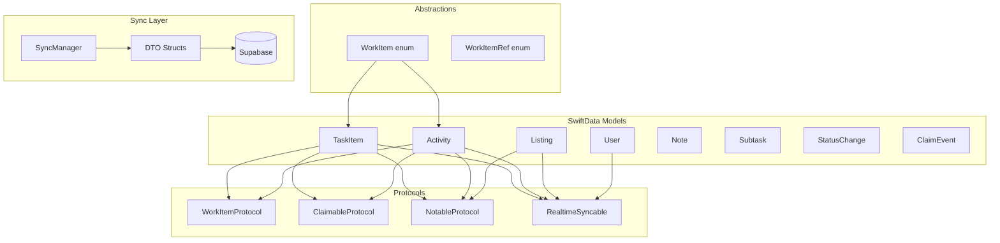
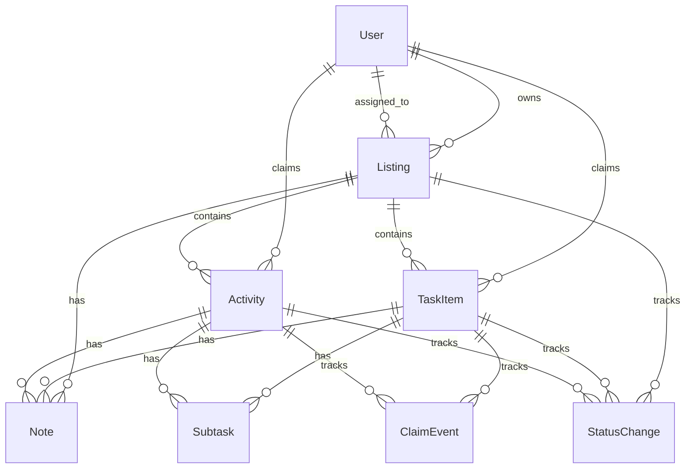
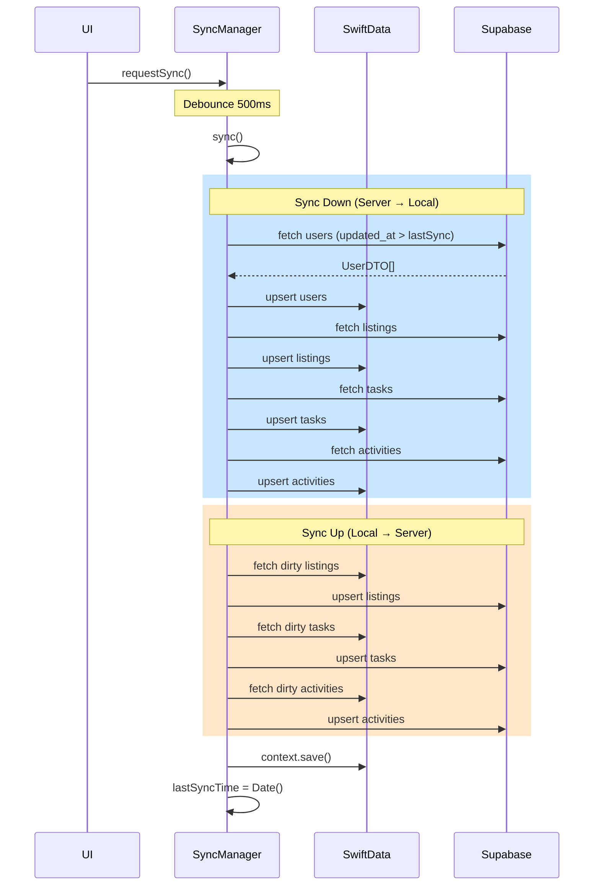

# Dispatch Data System

Technical reference for data models, protocols, enums, and sync architecture.

## Architecture Overview



## File Structure

```
Dispatch/
├── Models/
│   ├── TaskItem.swift
│   ├── Activity.swift
│   ├── Listing.swift
│   ├── User.swift
│   ├── Note.swift
│   ├── Subtask.swift
│   ├── StatusChange.swift
│   ├── ClaimEvent.swift
│   └── Enums/
│       ├── Priority.swift
│       ├── TaskStatus.swift
│       ├── ActivityStatus.swift
│       ├── ActivityType.swift
│       ├── ListingStatus.swift
│       ├── ListingType.swift
│       ├── UserType.swift
│       ├── ClaimState.swift
│       ├── ParentType.swift
│       ├── CreationSource.swift
│       ├── SyncStatus.swift
│       └── QuickEntryItemType.swift
├── Protocols/
│   ├── WorkItemProtocol.swift
│   ├── ClaimableProtocol.swift
│   ├── NotableProtocol.swift
│   └── RealtimeSyncable.swift
├── Services/
│   └── Sync/
│       └── SyncManager.swift
└── Utilities/
    └── DateSection.swift
```

---

## Core Models

### TaskItem

Work item that can be claimed and completed.

```swift
@Model
final class TaskItem: WorkItemProtocol, ClaimableProtocol, NotableProtocol, RealtimeSyncable {
    @Attribute(.unique) var id: UUID
    var title: String
    var taskDescription: String
    var dueDate: Date?
    var priority: Priority
    var status: TaskStatus

    // Foreign keys (UUIDs)
    var declaredBy: UUID
    var claimedBy: UUID?
    var listingId: UUID?

    // Metadata
    var createdVia: CreationSource
    var sourceSlackMessages: [String]?

    // Timestamps
    var claimedAt: Date?
    var completedAt: Date?
    var deletedAt: Date?
    var createdAt: Date
    var updatedAt: Date
    var syncedAt: Date?

    // Relationships (cascade delete)
    @Relationship(deleteRule: .cascade) var notes: [Note]
    @Relationship(deleteRule: .cascade) var subtasks: [Subtask]
    @Relationship(deleteRule: .cascade) var statusHistory: [StatusChange]
    @Relationship(deleteRule: .cascade) var claimHistory: [ClaimEvent]

    // Inverse relationships
    var claimedByUser: User?
    var listing: Listing?
}
```

### Activity

Scheduled activity (call, meeting, showing, etc.).

```swift
@Model
final class Activity: WorkItemProtocol, ClaimableProtocol, NotableProtocol, RealtimeSyncable {
    @Attribute(.unique) var id: UUID
    var title: String
    var activityDescription: String
    var type: ActivityType          // call, email, meeting, showProperty, followUp, other
    var dueDate: Date?
    var priority: Priority
    var status: ActivityStatus

    // Foreign keys
    var declaredBy: UUID
    var claimedBy: UUID?
    var listingId: UUID?

    // Metadata
    var createdVia: CreationSource
    var sourceSlackMessages: [String]?
    var duration: TimeInterval?     // Activity-specific

    // Timestamps (same as TaskItem)
    // Relationships (same as TaskItem)
}
```

### Listing

Property listing that groups tasks and activities.

```swift
@Model
final class Listing: NotableProtocol, RealtimeSyncable {
    @Attribute(.unique) var id: UUID
    var address: String
    var city: String
    var province: String
    var postalCode: String
    var country: String
    var price: Decimal?
    var mlsNumber: String?
    var listingType: ListingType    // sale, rental
    var status: ListingStatus       // draft, active, pending, closed, deleted

    // Foreign keys
    var ownedBy: UUID
    var assignedStaff: UUID?

    // Metadata
    var createdVia: CreationSource
    var sourceSlackMessages: [String]?

    // Timestamps
    var activatedAt: Date?
    var pendingAt: Date?
    var closedAt: Date?
    var deletedAt: Date?
    var createdAt: Date
    var updatedAt: Date
    var syncedAt: Date?

    // Relationships
    @Relationship(deleteRule: .cascade) var tasks: [TaskItem]
    @Relationship(deleteRule: .cascade) var activities: [Activity]
    @Relationship(deleteRule: .cascade) var notes: [Note]
    @Relationship(deleteRule: .cascade) var statusHistory: [StatusChange]

    // Inverse relationships
    var owner: User?
    var assignedStaffUser: User?
}
```

### User

User account (syncs DOWN only - read-only).

```swift
@Model
final class User: RealtimeSyncable {
    @Attribute(.unique) var id: UUID
    var name: String
    var email: String
    var avatar: Data?
    var userType: UserType          // admin, realtor

    // Timestamps
    var createdAt: Date
    var updatedAt: Date
    var syncedAt: Date?

    // Relationships
    @Relationship(deleteRule: .nullify, inverse: \Listing.owner)
    var listings: [Listing]

    @Relationship(deleteRule: .nullify, inverse: \TaskItem.claimedByUser)
    var claimedTasks: [TaskItem]

    @Relationship(deleteRule: .nullify, inverse: \Activity.claimedByUser)
    var claimedActivities: [Activity]

    @Relationship(deleteRule: .nullify, inverse: \Listing.assignedStaffUser)
    var assignedListings: [Listing]
}
```

### Note

Comment attached to a parent entity.

```swift
@Model
final class Note {
    @Attribute(.unique) var id: UUID
    var content: String
    var createdBy: UUID
    var parentType: ParentType      // task, activity, listing
    var parentId: UUID

    // Edit tracking
    var editedAt: Date?
    var editedBy: UUID?

    // Timestamps
    var createdAt: Date
    var syncedAt: Date?
}
```

### Subtask

Checklist item within a task or activity.

```swift
@Model
final class Subtask {
    @Attribute(.unique) var id: UUID
    var title: String
    var completed: Bool
    var parentType: ParentType      // task, activity
    var parentId: UUID

    // Timestamps
    var createdAt: Date
    var syncedAt: Date?
}
```

---

## Model Relationships



---

## Protocols

### WorkItemProtocol

Shared interface for TaskItem and Activity.

```swift
protocol WorkItemProtocol {
    var id: UUID { get }
    var title: String { get set }
    var dueDate: Date? { get set }
    var priority: Priority { get set }
    var declaredBy: UUID { get }
    var claimedBy: UUID? { get set }
    var listingId: UUID? { get set }
    var notes: [Note] { get }
    var subtasks: [Subtask] { get }
    var statusHistory: [StatusChange] { get }
    var claimHistory: [ClaimEvent] { get }
    var createdVia: CreationSource { get }
    var createdAt: Date { get }
    var updatedAt: Date { get set }
    var syncedAt: Date? { get set }
}
```

### RealtimeSyncable

Enables sync tracking for models.

```swift
protocol RealtimeSyncable {
    var isDirty: Bool { get }       // updatedAt > syncedAt
    var conflictResolution: ConflictResolution { get }  // default: .lastWriteWins
}
```

**Implementation:**
```swift
extension TaskItem: RealtimeSyncable {
    var isDirty: Bool {
        guard let syncedAt = syncedAt else { return true }
        return updatedAt > syncedAt
    }
}
```

---

## Enums

### Priority

```swift
enum Priority: String, Codable, CaseIterable, Comparable {
    case low
    case medium
    case high
    case urgent
}
```

**Order:** low < medium < high < urgent

### TaskStatus / ActivityStatus

```swift
enum TaskStatus: String, Codable, CaseIterable {
    case open
    case inProgress = "in_progress"
    case completed
    case deleted
}

enum ActivityStatus: String, Codable, CaseIterable {
    case open
    case inProgress = "in_progress"
    case completed
    case deleted
}
```

### ActivityType

```swift
enum ActivityType: String, Codable, CaseIterable {
    case call
    case email
    case meeting
    case showProperty = "show_property"
    case followUp = "follow_up"
    case other
}
```

### ListingStatus

```swift
enum ListingStatus: String, Codable, CaseIterable {
    case draft
    case active
    case pending
    case closed
    case deleted
}
```

### ListingType

```swift
enum ListingType: String, Codable, CaseIterable {
    case sale
    case rental
}
```

### UserType

```swift
enum UserType: String, Codable, CaseIterable {
    case admin
    case realtor
}
```

### ClaimState (UI-only)

Not Codable - contains User model references for UI display.

```swift
enum ClaimState {
    case unclaimed
    case claimedByMe(user: User)
    case claimedByOther(user: User)

    var isClaimed: Bool
    var canClaim: Bool
    var canRelease: Bool
}
```

### ParentType

Polymorphic parent reference for Note/Subtask.

```swift
enum ParentType: String, Codable, CaseIterable {
    case task
    case activity
    case listing
}
```

### CreationSource

```swift
enum CreationSource: String, Codable, CaseIterable {
    case dispatch       // Created in app
    case slack          // Created via Slack integration
}
```

### SyncStatus

```swift
enum SyncStatus: String, Codable, CaseIterable {
    case synced
    case syncing
    case pending
    case error
}
```

### QuickEntryItemType

```swift
enum QuickEntryItemType: String, CaseIterable, Identifiable {
    case task
    case activity

    var id: String { rawValue }
    var displayName: String
    var icon: String
}
```

### DateSection

For grouping work items by due date.

```swift
enum DateSection: String, CaseIterable, Identifiable {
    case overdue
    case today
    case tomorrow
    case upcoming
    case noDueDate
}
```

---

## WorkItem Abstraction

Unified wrapper for TaskItem and Activity in UI components.

```swift
enum WorkItem: Identifiable, Hashable {
    case task(TaskItem)
    case activity(Activity)

    var id: UUID
    var title: String
    var dueDate: Date?
    var priority: Priority
    var claimedBy: UUID?
    var notes: [Note]
    var subtasks: [Subtask]

    var isTask: Bool
    var isActivity: Bool
    var taskItem: TaskItem?
    var activityItem: Activity?
    var isCompleted: Bool
}
```

### WorkItemRef (Navigation-safe)

ID-only reference to avoid stale model references in NavigationPath.

```swift
enum WorkItemRef: Hashable, Codable {
    case task(UUID)
    case activity(UUID)

    static func from(_ item: WorkItem) -> WorkItemRef
}
```

**Usage:**
```swift
// In NavigationLink
NavigationLink(value: WorkItemRef.from(item)) {
    WorkItemRow(item: item, ...)
}

// Resolve in destination
.navigationDestination(for: WorkItemRef.self) { ref in
    WorkItemResolverView(ref: ref, ...)
}
```

---

## SyncManager

Singleton service orchestrating bidirectional sync.

### Key Properties

```swift
@MainActor
final class SyncManager: ObservableObject {
    static let shared = SyncManager()

    @Published private(set) var isSyncing: Bool
    @Published private(set) var lastSyncTime: Date?
    @Published private(set) var syncError: Error?
    @Published private(set) var syncStatus: SyncStatus
    @Published var currentUserID: UUID?
}
```

### API

```swift
// Configuration
func configure(with container: ModelContainer, testUserID: UUID?)

// Sync Operations
func requestSync()              // Debounced (500ms)
func sync() async               // Immediate full sync

// Realtime
func startListening() async     // Subscribe to Supabase realtime
func stopListening() async
```

### Sync Flow



### Sync Order

**Down:** Users → Listings → Tasks → Activities (FK dependencies)
**Up:** Listings → Tasks → Activities (Users are read-only)

### Dirty Detection

```swift
var isDirty: Bool {
    guard let syncedAt = syncedAt else { return true }
    return updatedAt > syncedAt
}
```

### Conflict Resolution

Last-write-wins: Server wins on syncDown, client wins on syncUp.

---

## DTO Pattern

Data Transfer Objects for Supabase serialization.

```
Model (SwiftData) ←→ DTO (Codable) ←→ JSON (Supabase)
```

### Example: TaskDTO

```swift
struct TaskDTO: Codable, Sendable {
    let id: UUID
    let title: String
    let description: String?
    let dueDate: Date?
    let priority: String
    let status: String
    let declaredBy: UUID
    let claimedBy: UUID?
    let listing: UUID?
    let createdVia: String
    let claimedAt: Date?
    let completedAt: Date?
    let deletedAt: Date?
    let createdAt: Date
    let updatedAt: Date

    // Conversions
    init(from model: TaskItem)
    func toModel() -> TaskItem
}
```

---

## Best Practices

### Creating Items

```swift
// Task
let task = TaskItem(
    title: "Schedule inspection",
    priority: .high,
    declaredBy: currentUserId,
    listingId: listing?.id
)
task.listing = listing
listing?.tasks.append(task)
modelContext.insert(task)
syncManager.requestSync()

// Activity
let activity = Activity(
    title: "Call buyer",
    type: .call,
    priority: .medium,
    declaredBy: currentUserId
)
modelContext.insert(activity)
syncManager.requestSync()
```

### Modifying Items

```swift
// Always update timestamps
task.status = .completed
task.completedAt = Date()
task.updatedAt = Date()  // Required for sync dirty detection
syncManager.requestSync()
```

### Deleting Items

Soft delete via status:

```swift
task.status = .deleted
task.deletedAt = Date()
task.updatedAt = Date()
syncManager.requestSync()
```

### Filtering Deleted Items

SwiftData predicates can't compare enums directly:

```swift
// In computed property
private var allTasks: [TaskItem] {
    allTasksRaw.filter { $0.status != .deleted }
}
```

### User Lookup Cache

Pre-compute for O(1) lookups in list views:

```swift
private var userCache: [UUID: User] {
    Dictionary(uniqueKeysWithValues: users.map { ($0.id, $0) })
}

// Usage
let claimedUser = userCache[item.claimedBy]
```

### Navigation with WorkItemRef

Avoid NavigationPath stale model issues:

```swift
// DON'T - model can become stale
NavigationLink(value: item) { ... }

// DO - ID-only reference
NavigationLink(value: WorkItemRef.from(item)) { ... }
```

### Performance: Avoid @Query in Sheets

@Query re-evaluates on every view update, causing keyboard lag:

```swift
// DON'T - in sheet
@Query var listings: [Listing]

// DO - pass from parent
struct QuickEntrySheet: View {
    let listings: [Listing]  // Passed from parent
}
```

Parent view holds the @Query:

```swift
// In parent (TaskListView)
@Query(sort: \Listing.address) private var allListings: [Listing]

.sheet(isPresented: $showQuickEntry) {
    QuickEntrySheet(listings: activeListings, ...)
}
```
