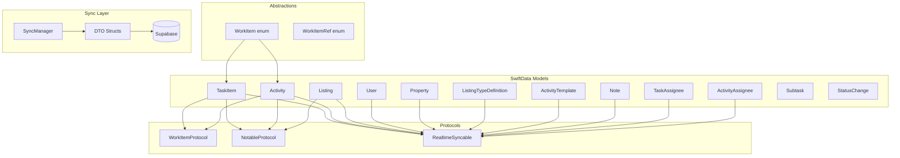
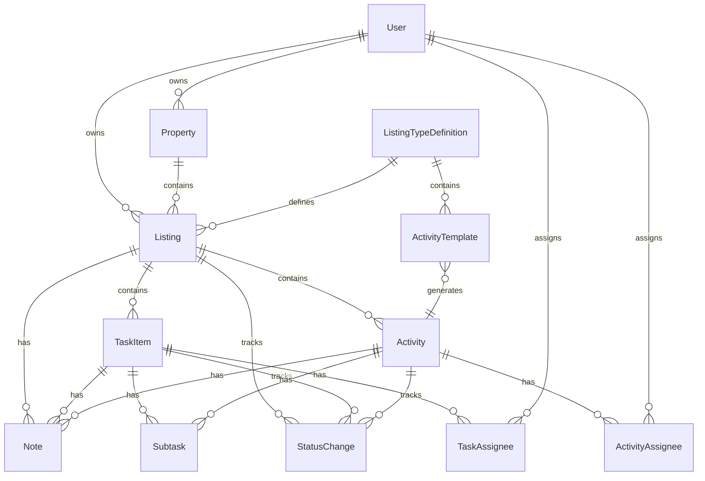
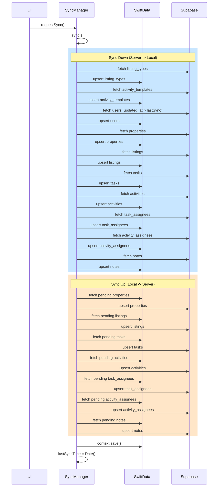

# Dispatch Data System

Technical reference for data models, protocols, enums, and sync architecture.

## Architecture Overview



## File Structure

```text
Dispatch/
├── Features/
│   ├── WorkItems/
│   │   ├── Models/
│   │   │   ├── TaskItem.swift
│   │   │   ├── Activity.swift
│   │   │   ├── TaskAssignee.swift
│   │   │   ├── ActivityAssignee.swift
│   │   │   ├── Note.swift
│   │   │   ├── Subtask.swift
│   │   │   ├── StatusChange.swift
│   │   │   └── Enums/
│   │   │       ├── TaskStatus.swift
│   │   │       ├── ActivityStatus.swift
│   │   │       ├── ParentType.swift
│   │   │       └── CreationSource.swift
│   │   ├── Protocols/
│   │   │   ├── WorkItemProtocol.swift
│   │   │   └── NotableProtocol.swift
│   │   ├── Views/Components/WorkItem/
│   │   │   ├── WorkItem.swift
│   │   │   └── WorkItemRef.swift
│   │   └── Utilities/
│   │       └── DateSection.swift
│   ├── Listings/
│   │   ├── Models/
│   │   │   ├── Listing.swift
│   │   │   ├── ListingTypeDefinition.swift
│   │   │   └── Enums/
│   │   │       ├── ListingStatus.swift
│   │   │       ├── ListingType.swift
│   │   │       └── ListingStage.swift
│   ├── Properties/
│   │   ├── Models/
│   │   │   ├── Property.swift
│   │   │   └── Enums/
│   │   │       └── PropertyType.swift
│   ├── Settings/
│   │   └── Models/
│   │       └── ActivityTemplate.swift
├── Foundation/
│   ├── Shared/
│   │   ├── User.swift
│   │   └── Enums/
│   │       ├── UserType.swift
│   │       ├── Role.swift
│   │       ├── AudienceLens.swift
│   │       └── ContentKind.swift
│   ├── Persistence/
│   │   ├── Sync/
│   │   │   └── SyncManager.swift
│   │   ├── Protocols/
│   │   │   └── RealtimeSyncable.swift
│   │   └── Enums/
│   │       ├── EntitySyncState.swift
│   │       ├── SyncStatus.swift
│   │       └── ConflictStrategy.swift
│   └── Networking/Supabase/DTOs/
│       ├── TaskDTO.swift
│       ├── ActivityDTO.swift
│       ├── TaskAssigneeDTO.swift
│       ├── ActivityAssigneeDTO.swift
│       ├── ListingDTO.swift
│       ├── PropertyDTO.swift
│       ├── ListingTypeDefinitionDTO.swift
│       ├── ActivityTemplateDTO.swift
│       ├── UserDTO.swift
│       ├── NoteDTO.swift
│       ├── SubtaskDTO.swift
│       └── StatusChangeDTO.swift
```

---

## Core Models

### TaskItem

Work item that can be assigned to multiple users and completed.

```swift
@Model
final class TaskItem: WorkItemProtocol, NotableProtocol, RealtimeSyncable {
    @Attribute(.unique) var id: UUID
    var title: String
    var taskDescription: String
    var dueDate: Date?
    var status: TaskStatus

    // Foreign keys (UUIDs)
    var declaredBy: UUID
    var listingId: UUID?

    // Metadata
    var createdVia: CreationSource
    var sourceSlackMessages: [String]?

    // Audience targeting (stored as [String] for SwiftData compatibility)
    var audiencesRaw: [String] = ["admin", "marketing"]
    var audiences: Set<Role> { get set }  // Computed wrapper

    // Timestamps
    var completedAt: Date?
    var deletedAt: Date?
    var createdAt: Date
    var updatedAt: Date
    var syncedAt: Date?

    // Sync state tracking
    var syncStateRaw: EntitySyncState?
    var syncState: EntitySyncState { get set }  // Computed wrapper, defaults to .synced
    var lastSyncError: String?

    // Relationships (cascade delete)
    @Relationship(deleteRule: .cascade) var notes: [Note]
    @Relationship(deleteRule: .cascade) var subtasks: [Subtask]
    @Relationship(deleteRule: .cascade) var statusHistory: [StatusChange]
    @Relationship(deleteRule: .cascade, inverse: \TaskAssignee.task) var assignees: [TaskAssignee]

    // Inverse relationships
    var listing: Listing?

    // Computed property for assignee user IDs
    var assigneeUserIds: [UUID] { assignees.map { $0.userId } }

    // RealtimeSyncable methods
    func markPending()
    func markSynced()
    func markFailed(_ message: String)
}
```

### Activity

Scheduled activity (call, meeting, showing, etc.).

```swift
@Model
final class Activity: WorkItemProtocol, NotableProtocol, RealtimeSyncable {
    @Attribute(.unique) var id: UUID
    var title: String
    var activityDescription: String
    var dueDate: Date?
    var status: ActivityStatus

    // Foreign keys
    var declaredBy: UUID
    var listingId: UUID?
    var sourceTemplateId: UUID?  // Links to ActivityTemplate that generated this

    // Metadata
    var createdVia: CreationSource
    var sourceSlackMessages: [String]?
    var duration: TimeInterval?

    // Audience targeting (stored as [String] for SwiftData compatibility)
    var audiencesRaw: [String] = ["admin", "marketing"]
    var audiences: Set<Role> { get set }  // Computed wrapper

    // Timestamps
    var completedAt: Date?
    var deletedAt: Date?
    var createdAt: Date
    var updatedAt: Date
    var syncedAt: Date?

    // Sync state tracking
    var syncStateRaw: EntitySyncState?
    var syncState: EntitySyncState { get set }
    var lastSyncError: String?

    // Relationships (cascade delete)
    @Relationship(deleteRule: .cascade) var notes: [Note]
    @Relationship(deleteRule: .cascade) var subtasks: [Subtask]
    @Relationship(deleteRule: .cascade) var statusHistory: [StatusChange]
    @Relationship(deleteRule: .cascade, inverse: \ActivityAssignee.activity) var assignees: [ActivityAssignee]

    // Inverse relationships
    var listing: Listing?
    var sourceTemplate: ActivityTemplate?

    // Computed property for assignee user IDs
    var assigneeUserIds: [UUID] { assignees.map { $0.userId } }

    // RealtimeSyncable methods
    func markPending()
    func markSynced()
    func markFailed(_ message: String)
}
```

### TaskAssignee

Join table for multi-user task assignments.

```swift
@Model
final class TaskAssignee: RealtimeSyncable {
    @Attribute(.unique) var id: UUID

    // Foreign keys
    var taskId: UUID
    var userId: UUID      // The assigned user
    var assignedBy: UUID  // Who made the assignment

    // When the assignment was made
    var assignedAt: Date

    // Timestamps
    var createdAt: Date
    var updatedAt: Date
    var syncedAt: Date?

    // Sync state tracking
    var syncStateRaw: EntitySyncState?
    var syncState: EntitySyncState { get set }
    var lastSyncError: String?

    // Relationship to parent task
    var task: TaskItem?

    // RealtimeSyncable methods
    func markPending()
    func markSynced()
    func markFailed(_ message: String)
}
```

### ActivityAssignee

Join table for multi-user activity assignments.

```swift
@Model
final class ActivityAssignee: RealtimeSyncable {
    @Attribute(.unique) var id: UUID

    // Foreign keys
    var activityId: UUID
    var userId: UUID      // The assigned user
    var assignedBy: UUID  // Who made the assignment

    // When the assignment was made
    var assignedAt: Date

    // Timestamps
    var createdAt: Date
    var updatedAt: Date
    var syncedAt: Date?

    // Sync state tracking
    var syncStateRaw: EntitySyncState?
    var syncState: EntitySyncState { get set }
    var lastSyncError: String?

    // Relationship to parent activity
    var activity: Activity?

    // RealtimeSyncable methods
    func markPending()
    func markSynced()
    func markFailed(_ message: String)
}
```

### Listing

Property listing that groups tasks and activities.

```swift
@Model
final class Listing: NotableProtocol, RealtimeSyncable {
    @Attribute(.unique) var id: UUID
    var address: String
    var city: String
    var province: String
    var postalCode: String
    var country: String
    var price: Decimal?
    var mlsNumber: String?
    var listingType: ListingType    // sale, lease, preListing, rental, other
    var status: ListingStatus       // draft, active, pending, closed, deleted
    var stageRaw: ListingStage?     // pending, working_on, live, sold, re_list, done

    // Foreign keys
    var ownedBy: UUID
    var propertyId: UUID?
    var typeDefinitionId: UUID?     // Links to ListingTypeDefinition

    // Metadata
    var createdVia: CreationSource
    var sourceSlackMessages: [String]?

    // Timestamps
    var activatedAt: Date?
    var pendingAt: Date?
    var closedAt: Date?
    var deletedAt: Date?
    var dueDate: Date?
    var createdAt: Date
    var updatedAt: Date
    var syncedAt: Date?

    // Sync state tracking
    var syncStateRaw: EntitySyncState?
    var syncState: EntitySyncState { get set }
    var lastSyncError: String?

    // Relationships
    @Relationship(deleteRule: .cascade) var tasks: [TaskItem]
    @Relationship(deleteRule: .cascade) var activities: [Activity]
    @Relationship(deleteRule: .cascade) var notes: [Note]
    @Relationship(deleteRule: .cascade) var statusHistory: [StatusChange]

    // Inverse relationships
    var owner: User?
    var typeDefinition: ListingTypeDefinition?
    @Relationship(deleteRule: .nullify) var property: Property?

    // Computed stage with fallback
    var stage: ListingStage {
        get { stageRaw ?? .pending }
        set { stageRaw = newValue }
    }

    // RealtimeSyncable methods
    func markPending()
    func markSynced()
    func markFailed(_ message: String)
}
```

### Property

Property entity that groups multiple listings at a single location.

```swift
@Model
final class Property: RealtimeSyncable {
    @Attribute(.unique) var id: UUID
    var address: String
    var unit: String?
    var city: String
    var province: String
    var postalCode: String
    var country: String
    var propertyType: PropertyType  // residential, commercial, land, multiFamily, condo, other

    // Foreign keys
    var ownedBy: UUID

    // Metadata
    var createdVia: CreationSource

    // Timestamps
    var deletedAt: Date?
    var createdAt: Date
    var updatedAt: Date
    var syncedAt: Date?

    // Sync state tracking
    var syncStateRaw: EntitySyncState?
    var syncState: EntitySyncState { get set }
    var lastSyncError: String?

    // Relationships
    @Relationship(deleteRule: .nullify, inverse: \Listing.property) var listings: [Listing]

    // Inverse relationships
    var owner: User?

    // Computed
    var activeListings: [Listing] { listings.filter { $0.deletedAt == nil } }
    var displayAddress: String

    // RealtimeSyncable methods
    func markPending()
    func markSynced()
    func markFailed(_ message: String)
}
```

### ListingTypeDefinition

Dynamic listing type definition for auto-generated activities.

```swift
@Model
final class ListingTypeDefinition: RealtimeSyncable {
    @Attribute(.unique) var id: UUID
    var name: String
    var position: Int
    var isArchived: Bool

    // Foreign keys
    var ownedBy: UUID?

    // Timestamps
    var createdAt: Date
    var updatedAt: Date
    var syncedAt: Date?

    // Sync state tracking
    var syncStateRaw: EntitySyncState?
    var syncState: EntitySyncState { get set }
    var lastSyncError: String?

    // Relationships
    @Relationship(deleteRule: .cascade, inverse: \ActivityTemplate.listingType) var templates: [ActivityTemplate]
    @Relationship(inverse: \Listing.typeDefinition) var listings: [Listing]

    // RealtimeSyncable methods
    func markPending()
    func markSynced()
    func markFailed(_ message: String)
}
```

### ActivityTemplate

Template for auto-generated activities linked to listing types.

```swift
@Model
final class ActivityTemplate: RealtimeSyncable {
    @Attribute(.unique) var id: UUID
    var title: String
    var templateDescription: String
    var position: Int
    var isArchived: Bool

    // Audience targeting
    var audiencesRaw: [String]
    var audiences: Set<Role> { get set }  // Computed wrapper

    // Foreign keys
    var listingTypeId: UUID
    var defaultAssigneeId: UUID?

    // Timestamps
    var createdAt: Date
    var updatedAt: Date
    var syncedAt: Date?

    // Sync state tracking
    var syncStateRaw: EntitySyncState?
    var syncState: EntitySyncState { get set }
    var lastSyncError: String?

    // Relationships
    var listingType: ListingTypeDefinition?
    var defaultAssignee: User?

    // RealtimeSyncable methods
    func markPending()
    func markSynced()
    func markFailed(_ message: String)
}
```

### User

User account (syncs DOWN only - read-only from client).

```swift
@Model
final class User: RealtimeSyncable {
    @Attribute(.unique) var id: UUID
    var authId: UUID?       // Links to Supabase Auth (Shadow Profile support)
    var name: String
    var email: String
    var avatar: Data?
    var avatarHash: String?
    var userType: UserType  // realtor, admin, marketing, operator, exec

    // Timestamps
    var createdAt: Date
    var updatedAt: Date
    var syncedAt: Date?

    // Sync state tracking
    var syncStateRaw: EntitySyncState?
    var syncState: EntitySyncState { get set }
    var lastSyncError: String?

    // Relationships (for realtors)
    @Relationship(deleteRule: .nullify, inverse: \Listing.owner) var listings: [Listing]

    // RealtimeSyncable methods
    func markPending()
    func markSynced()
    func markFailed(_ message: String)
}
```

### Note

Comment attached to a parent entity.

```swift
@Model
final class Note: RealtimeSyncable {
    @Attribute(.unique) var id: UUID
    var content: String
    var createdBy: UUID
    var parentType: ParentType      // task, activity, listing
    var parentId: UUID

    // Edit tracking
    var editedAt: Date?
    var editedBy: UUID?

    // Timestamps
    var createdAt: Date
    var updatedAt: Date
    var deletedAt: Date?    // Soft delete tombstone
    var deletedBy: UUID?    // Who soft-deleted (enables undo)
    var syncedAt: Date?

    // Sync state tracking
    var syncStateRaw: EntitySyncState?
    var syncState: EntitySyncState { get set }
    var lastSyncError: String?

    // Conflict tracking (Local only, not synced)
    var hasRemoteChangeWhilePending: Bool

    // RealtimeSyncable methods
    func markPending()
    func markSynced()
    func markFailed(_ message: String)
    func softDelete(by userId: UUID)
    func undoDelete()
}
```

### Subtask

Checklist item within a task or activity.

```swift
@Model
final class Subtask {
    @Attribute(.unique) var id: UUID
    var title: String
    var completed: Bool
    var parentType: ParentType      // task, activity
    var parentId: UUID

    // Timestamps
    var createdAt: Date
    var syncedAt: Date?
}
```

### StatusChange

Tracks status changes for audit history.

```swift
@Model
final class StatusChange {
    @Attribute(.unique) var id: UUID
    var parentType: ParentType
    var parentId: UUID
    var oldStatus: String?
    var newStatus: String
    var changedBy: UUID
    var changedAt: Date
    var reason: String?
    var syncedAt: Date?
}
```

---

## Model Relationships



---

## Multi-Assignee Pattern

Tasks and activities use a multi-assignee pattern via join tables instead of a single `claimedBy` field.

### Assigning Users

```swift
// Assign a user to a task
let assignee = TaskAssignee(
    taskId: task.id,
    userId: user.id,
    assignedBy: currentUser.id
)
task.assignees.append(assignee)
assignee.markPending()
syncManager.requestSync()

// Assign a user to an activity
let assignee = ActivityAssignee(
    activityId: activity.id,
    userId: user.id,
    assignedBy: currentUser.id
)
activity.assignees.append(assignee)
assignee.markPending()
syncManager.requestSync()
```

### Getting Assignees

```swift
// Get assigned user IDs (computed property)
let userIds: [UUID] = task.assigneeUserIds

// Check if a specific user is assigned
let isAssigned = task.assigneeUserIds.contains(userId)

// Get all assignee records (for metadata like assignedAt, assignedBy)
let assigneeRecords: [TaskAssignee] = task.assignees
```

### Removing Assignments

```swift
// Remove an assignment
if let assignee = task.assignees.first(where: { $0.userId == userIdToRemove }) {
    task.assignees.removeAll { $0.id == assignee.id }
    // The assignee record will be deleted via cascade
}
task.markPending()
syncManager.requestSync()
```

---

## Protocols

### WorkItemProtocol

Shared interface for TaskItem and Activity.

```swift
protocol WorkItemProtocol {
    var id: UUID { get }
    var title: String { get set }
    var dueDate: Date? { get set }
    var declaredBy: UUID { get }
    var assigneeUserIds: [UUID] { get }
    var listingId: UUID? { get set }
    var notes: [Note] { get }
    var subtasks: [Subtask] { get }
    var statusHistory: [StatusChange] { get }
    var createdVia: CreationSource { get }
    var createdAt: Date { get }
    var updatedAt: Date { get set }
    var syncedAt: Date? { get set }
}
```

### NotableProtocol

Interface for entities that can have notes.

```swift
protocol NotableProtocol {
    var notes: [Note] { get }
}
```

### RealtimeSyncable

Enables sync tracking for models.

```swift
protocol RealtimeSyncable {
    var syncedAt: Date? { get set }
    var syncState: EntitySyncState { get set }
    var lastSyncError: String? { get set }
    var conflictResolution: ConflictStrategy { get }  // Default: .lastWriteWins
}

extension RealtimeSyncable {
    var conflictResolution: ConflictStrategy { .lastWriteWins }
    var isDirty: Bool { syncState == .pending }
    var isSyncFailed: Bool { syncState == .failed }
}
```

---

## Enums

### TaskStatus / ActivityStatus

```swift
enum TaskStatus: String, Codable, CaseIterable {
    case open
    case inProgress = "in_progress"
    case completed
    case deleted
}

enum ActivityStatus: String, Codable, CaseIterable {
    case open
    case inProgress = "in_progress"
    case completed
    case deleted
}
```

### ListingStatus

```swift
enum ListingStatus: String, Codable, CaseIterable {
    case draft
    case active
    case pending
    case closed
    case deleted

    var displayName: String { rawValue.capitalized }
}
```

### ListingStage

Lifecycle stage for a listing (6 stages).

```swift
enum ListingStage: String, Codable, CaseIterable {
    case pending
    case workingOn = "working_on"
    case live
    case sold
    case reList = "re_list"
    case done

    var displayName: String
    var sortOrder: Int
}
```

### ListingType

```swift
enum ListingType: String, Codable, CaseIterable {
    case sale
    case lease
    case preListing = "pre_listing"
    case rental
    case other
}
```

### PropertyType

```swift
enum PropertyType: String, Codable, CaseIterable {
    case residential
    case commercial
    case land
    case multiFamily = "multi_family"
    case condo
    case other

    var displayName: String
    var icon: String
}
```

### UserType

```swift
enum UserType: String, Codable, CaseIterable {
    case realtor
    case admin
    case marketing
    case `operator`
    case exec

    /// Staff members can be assigned to tasks/activities.
    /// Admin, marketing, and operator are staff.
    var isStaff: Bool { self == .admin || self == .marketing || self == .operator }
    var displayName: String
}
```

### Role

Audience targeting roles.

```swift
enum Role: String, Codable, CaseIterable, Hashable {
    case admin
    case marketing
}
```

### ParentType

Polymorphic parent reference for Note/Subtask/StatusChange.

```swift
enum ParentType: String, Codable, CaseIterable {
    case task
    case activity
    case listing
}
```

### CreationSource

```swift
enum CreationSource: String, Codable, CaseIterable {
    case dispatch       // Created in app
    case slack          // Created via Slack integration
    case realtorApp = "realtor_app"
    case api
    case `import`
}
```

### EntitySyncState

Per-entity sync state tracking.

```swift
enum EntitySyncState: String, Codable, Equatable {
    case synced     // Entity is synchronized with server
    case pending    // Entity has local changes pending sync
    case failed     // Entity sync failed - check lastSyncError
}
```

### SyncStatus

Global sync status for SyncManager.

```swift
enum SyncStatus: Equatable {
    case idle              // Nothing happening
    case syncing           // Active sync in progress
    case ok(Date)          // Last successful sync time
    case error             // Error exists; details in lastSyncErrorMessage
}
```

### ConflictStrategy

```swift
enum ConflictStrategy: String, Codable, CaseIterable {
    case lastWriteWins = "last_write_wins"
    case serverWins = "server_wins"
    case manual
}
```

### QuickEntryItemType

```swift
enum QuickEntryItemType: String, CaseIterable, Identifiable {
    case task
    case activity

    var id: String { rawValue }
    var displayName: String
    var icon: String
}
```

### DateSection

For grouping work items by due date.

```swift
enum DateSection: String, CaseIterable, Identifiable {
    case overdue = "Overdue"
    case today = "Today"
    case tomorrow = "Tomorrow"
    case upcoming = "Upcoming"
    case noDueDate = "No Due Date"

    var id: String { rawValue }
    var headerColor: Color

    static func section(for date: Date?, referenceDate: Date = Date()) -> DateSection
    static func group(_ items: [WorkItem], referenceDate: Date = Date()) -> [DateSection: [WorkItem]]
    static func sortedSections(from items: [WorkItem], referenceDate: Date = Date()) -> [(section: DateSection, items: [WorkItem])]
}
```

### AudienceLens

Filter mode for viewing work items based on target audience.

```swift
enum AudienceLens: String, CaseIterable {
    case all
    case admin
    case marketing

    var next: AudienceLens      // Cycles: All -> Admin -> Marketing -> All
    var label: String
    var icon: String
    var tintColor: Color
    func matches(audiences: Set<Role>) -> Bool
}
```

### ContentKind

Filter mode for viewing work items by content type.

```swift
enum ContentKind: String, CaseIterable {
    case all
    case tasks
    case activities

    var next: ContentKind       // Cycles: All -> Tasks -> Activities -> All
    var label: String
}
```

---

## WorkItem Abstraction

Unified wrapper for TaskItem and Activity in UI components.

**Critical**: WorkItem caches ALL display properties at construction time via `WorkItemSnapshot`.
This prevents crashes when SwiftUI renders views after a ModelContext reset has invalidated the underlying SwiftData models.

```swift
struct WorkItemSnapshot: Equatable, Hashable {
    let id: UUID
    let title: String
    let itemDescription: String
    let dueDate: Date?
    let assigneeUserIds: [UUID]
    let subtaskCount: Int
    let completedSubtaskCount: Int
    let noteCount: Int
    let createdAt: Date
    let updatedAt: Date
    let declaredBy: UUID
    let isCompleted: Bool
    let isDeleted: Bool
    let typeLabel: String
    let typeIcon: String
    let statusRawValue: String
    let syncState: EntitySyncState
    let lastSyncError: String?
    let audiences: Set<Role>
    let listingId: UUID?
}

enum WorkItem: Identifiable, Hashable, Equatable {
    case task(TaskItem, snapshot: WorkItemSnapshot)
    case activity(Activity, snapshot: WorkItemSnapshot)

    // All property access uses cached snapshot values
    var id: UUID
    var title: String
    var dueDate: Date?
    var assigneeUserIds: [UUID]
    var audiences: Set<Role>
    var subtaskProgress: Double
    var isCompleted: Bool
    var syncState: EntitySyncState
    var isSyncFailed: Bool

    // Factory methods (capture snapshot at creation)
    static func task(_ task: TaskItem) -> WorkItem
    static func activity(_ activity: Activity) -> WorkItem

    // Live model access (USE WITH CAUTION - only for mutations)
    var taskItem: TaskItem?
    var activityItem: Activity?
    var notes: [Note]       // Live access - may crash if model invalidated
    var subtasks: [Subtask] // Live access - may crash if model invalidated
}
```

### WorkItemRef (Navigation-safe)

ID-only reference to avoid stale model references in NavigationPath.

```swift
enum WorkItemRef: Hashable, Identifiable {
    case task(id: UUID)
    case activity(id: UUID)

    var id: UUID
    var isTask: Bool
    var isActivity: Bool

    static func task(_ task: TaskItem) -> WorkItemRef
    static func activity(_ activity: Activity) -> WorkItemRef
    static func from(_ workItem: WorkItem) -> WorkItemRef
}
```

**Usage:**
```swift
// In NavigationLink
NavigationLink(value: WorkItemRef.from(item)) {
    WorkItemRow(item: item, ...)
}

// Resolve in destination
.navigationDestination(for: WorkItemRef.self) { ref in
    WorkItemResolverView(ref: ref, ...)
}
```

---

## SyncManager

Singleton service orchestrating bidirectional sync.

### Key Properties

```swift
@MainActor
final class SyncManager: ObservableObject {
    static let shared = SyncManager()

    @Published private(set) var isSyncing: Bool
    @Published private(set) var isListingConfigReady: Bool  // UI gate for AddListingSheet
    @Published private(set) var lastSyncTime: Date?
    @Published private(set) var syncError: Error?
    @Published private(set) var syncStatus: SyncStatus
    @Published private(set) var lastSyncErrorMessage: String?
    @Published private(set) var syncRunId: Int
    @Published var currentUserID: UUID?
    @Published var currentUser: User?
}
```

### API

```swift
// Configuration
func configure(with container: ModelContainer)

// Sync Operations
func requestSync()              // Triggers coalesced sync (idempotent)
func sync() async               // Immediate full sync
func fullSync() async           // Force full reconciliation (ignores lastSyncTime)
func retrySync() async          // Retry failed entities
func resetLastSyncTime()        // Force next sync to run full reconciliation

// Realtime
func startListening() async     // Subscribe to Supabase realtime
func stopListening() async
func shutdown() async           // Deterministic shutdown with strict ordering
```

### Sync Flow



### Sync Order

**Down:** ListingTypes -> ActivityTemplates -> Users -> Properties -> Listings -> Tasks -> Activities -> TaskAssignees -> ActivityAssignees -> Notes (FK dependencies)

**Up:** Users -> Properties -> Listings -> Tasks -> Activities -> TaskAssignees -> ActivityAssignees -> Notes (FK dependencies, Users read-only for most)

### Dirty Detection

Uses `EntitySyncState.pending` instead of timestamp comparison:

```swift
var isDirty: Bool {
    syncState == .pending
}
```

### Local-First Sync Guard

Local-authoritative items are NOT overwritten by server state until SyncUp succeeds:

```swift
func isLocalAuthoritative<T: RealtimeSyncable>(_ model: T, inFlight: Bool) -> Bool {
    model.syncState == .pending || model.syncState == .failed || inFlight
}
```

### Conflict Resolution

Last-write-wins: Server wins on syncDown (unless local-authoritative), client wins on syncUp.

---

## DTO Pattern

Data Transfer Objects for Supabase serialization.

```text
Model (SwiftData) <-> DTO (Codable) <-> JSON (Supabase)
```

### Available DTOs

| DTO | Model | Notes |
|-----|-------|-------|
| TaskDTO | TaskItem | |
| ActivityDTO | Activity | |
| TaskAssigneeDTO | TaskAssignee | |
| ActivityAssigneeDTO | ActivityAssignee | |
| ListingDTO | Listing | |
| PropertyDTO | Property | |
| ListingTypeDefinitionDTO | ListingTypeDefinition | |
| ActivityTemplateDTO | ActivityTemplate | |
| UserDTO | User | |
| NoteDTO | Note | |
| SubtaskDTO | Subtask | |
| StatusChangeDTO | StatusChange | |

### Example: TaskDTO

```swift
struct TaskDTO: Codable, Sendable {
    let id: UUID
    let title: String
    let description: String?
    let dueDate: Date?
    let status: String
    let declaredBy: UUID
    let listing: UUID?          // Supabase column is "listing" not "listing_id"
    let createdVia: String
    let sourceSlackMessages: [String]?
    let audiences: [String]?
    let completedAt: Date?
    let deletedAt: Date?
    let createdAt: Date
    let updatedAt: Date

    // Conversions
    func toModel() -> TaskItem
}
```

---

## Best Practices

### Creating Items

```swift
// Task
let task = TaskItem(
    title: "Schedule inspection",
    declaredBy: currentUserId,
    listingId: listing?.id
)
task.listing = listing
listing?.tasks.append(task)
modelContext.insert(task)
task.markPending()  // Mark for sync
syncManager.requestSync()

// Activity
let activity = Activity(
    title: "Call buyer",
    declaredBy: currentUserId
)
modelContext.insert(activity)
activity.markPending()
syncManager.requestSync()
```

### Modifying Items

```swift
// Use markPending() instead of manually updating timestamps
task.status = .completed
task.completedAt = Date()
task.markPending()  // Sets syncState = .pending, clears lastSyncError, updates updatedAt
syncManager.requestSync()
```

### Deleting Items

Soft delete via status:

```swift
task.status = .deleted
task.deletedAt = Date()
task.markPending()
syncManager.requestSync()
```

### Filtering Deleted Items

SwiftData predicates can't compare enums directly:

```swift
// In computed property
private var allTasks: [TaskItem] {
    allTasksRaw.filter { $0.status != .deleted }
}
```

### User Lookup Cache

Pre-compute for O(1) lookups in list views:

```swift
private var userCache: [UUID: User] {
    Dictionary(uniqueKeysWithValues: users.map { ($0.id, $0) })
}

// Usage
let assignedUsers = task.assigneeUserIds.compactMap { userCache[$0] }
```

### Navigation with WorkItemRef

Avoid NavigationPath stale model issues:

```swift
// DON'T - model can become stale
NavigationLink(value: item) { ... }

// DO - ID-only reference
NavigationLink(value: WorkItemRef.from(item)) { ... }
```

### Performance: Avoid @Query in Sheets

@Query re-evaluates on every view update, causing keyboard lag:

```swift
// DON'T - in sheet
@Query var listings: [Listing]

// DO - pass from parent
struct QuickEntrySheet: View {
    let listings: [Listing]  // Passed from parent
}
```

Parent view holds the @Query:

```swift
// In parent (TaskListView)
@Query(sort: \Listing.address) private var allListings: [Listing]

.sheet(isPresented: $showQuickEntry) {
    QuickEntrySheet(listings: activeListings, ...)
}
```
