# Dispatch Design System

Technical reference for the design token system used throughout the app.

## Architecture Overview


## File Structure

```text
Dispatch/Design/
├── DesignSystem.swift      # Main DS namespace declaration
├── ColorSystem.swift       # DS.Colors - semantic colors
├── Typography.swift        # DS.Typography - font styles
├── Spacing.swift           # DS.Spacing - 4pt grid system
├── Shadows.swift           # DS.Shadows - elevation styles
├── IconSystem.swift        # DS.Icons - SF Symbol tokens
├── Components/
│   └── AudienceLensButton.swift  # Audience lens filter button
└── Effects/
    └── GlassEffect.swift   # Glass effect view modifiers
```

## Usage Pattern

All tokens accessed via `DS` namespace:

```swift
// Colors
DS.Colors.PriorityColors.color(for: .high)  // Orange
DS.Colors.Status.color(for: .completed)     // Green
DS.Colors.Background.primary                 // System background
DS.Colors.Text.secondary                     // Dimmed text
DS.Colors.RoleColors.color(for: .admin)     // Indigo

// Typography
DS.Typography.headline                       // Card titles
DS.Typography.body                           // Content text
DS.Typography.caption                        // Timestamps

// Spacing
DS.Spacing.md                               // 12pt default
DS.Spacing.cardPadding                      // 12pt
DS.Spacing.radiusCard                       // 10pt

// Shadows
.dsShadow(DS.Shadows.card)                  // Card elevation
DS.Shadows.notesOverflowGradient            // Notes stack gradient

// Icons
DS.Icons.Action.add                         // "plus"
DS.Icons.Entity.task                        // "checkmark.square"
DS.Icons.StatusIcons.icon(for: .completed)  // "checkmark.circle.fill"

// Effects
.glassCircleBackground()                    // iOS 26+ glass effect
```

---

## Colors (DS.Colors)

### Priority Colors

| Token | Value | Usage |
|-------|-------|-------|
| `PriorityColors.low` | Gray | Low priority indicator |
| `PriorityColors.medium` | Blue | Medium priority indicator |
| `PriorityColors.high` | Orange | High priority indicator |
| `PriorityColors.urgent` | Red | Urgent priority indicator |

**Helper:** `DS.Colors.PriorityColors.color(for: Priority) -> Color`

### Status Colors

| Token | Value | Usage |
|-------|-------|-------|
| `Status.open` | Blue | Open/new items |
| `Status.inProgress` | Orange | In progress items |
| `Status.completed` | Green | Completed items |
| `Status.deleted` | Gray (50% opacity) | Deleted items |

**Helpers:**
- `DS.Colors.Status.color(for: TaskStatus) -> Color`
- `DS.Colors.Status.color(for: ActivityStatus) -> Color`

### Sync Colors

| Token | Value | Usage |
|-------|-------|-------|
| `Sync.ok` | Green | Successfully synced |
| `Sync.syncing` | Blue | Currently syncing |
| `Sync.idle` | Gray | Idle state |
| `Sync.error` | Red | Sync error |

**Helper:** `DS.Colors.Sync.color(for: SyncStatus) -> Color`

### Claim Colors

| Token | Value | Usage |
|-------|-------|-------|
| `Claim.unclaimed` | Gray | Available to claim |
| `Claim.claimedByMe` | Green | Claimed by current user |
| `Claim.claimedByOther` | Orange | Claimed by another user |

**Helper:** `DS.Colors.Claim.color(for: ClaimState) -> Color`

### Role Colors

| Token | Value | Usage |
|-------|-------|-------|
| `RoleColors.admin` | Indigo | Admin role indicator |
| `RoleColors.marketing` | Orange | Marketing role indicator |
| `RoleColors.all` | Gray | All roles (neutral) |

**Helper:** `DS.Colors.RoleColors.color(for: Role) -> Color`

### Background Colors (Adaptive)

| Token | UIKit Equivalent | Usage |
|-------|------------------|-------|
| `Background.primary` | systemBackground | Main background |
| `Background.secondary` | secondarySystemBackground | Subtle sections |
| `Background.tertiary` | tertiarySystemBackground | Deeper sections |
| `Background.grouped` | systemGroupedBackground | Grouped content |
| `Background.groupedSecondary` | secondarySystemGroupedBackground | Layered surfaces |
| `Background.card` | systemGray6 | Card backgrounds |
| `Background.cardDark` | systemGray5 | Darker cards |

### Text Colors (Adaptive)

| Token | Usage |
|-------|-------|
| `Text.primary` | Main content |
| `Text.secondary` | Dimmed labels |
| `Text.tertiary` | More dimmed |
| `Text.quaternary` | Most dimmed |
| `Text.disabled` | Disabled state |
| `Text.placeholder` | Placeholder text |

### Progress Colors

| Token | Value | Usage |
|-------|-------|-------|
| `Progress.track` | Text.tertiary @ 30% | Progress ring background |

### UI Element Colors

| Token | Value | Usage |
|-------|-------|-------|
| `accent` | accentColor | App accent |
| `destructive` | Red | Delete actions |
| `success` | Green | Success states |
| `warning` | Orange | Warning states |
| `info` | Blue | Info states |
| `border` | Gray 20% | Standard borders |
| `borderFocused` | accentColor | Focused borders |
| `separator` | systemSeparator | Dividers |
| `overdue` | Red | Overdue items |
| `dueSoon` | Orange | Due within 24h |
| `dueNormal` | Secondary | Normal due dates |
| `searchScrim` | Black 40% | Search overlay background |

---

## Typography (DS.Typography)

### Hierarchy

```mermaid
graph LR
    subgraph Titles
        LT[largeTitle 32pt bold]
        T[title 22pt semibold]
        T3[title3 20pt semibold]
        H[headline 17pt semibold]
    end

    subgraph Body
        B[body 17pt]
        BS[bodySecondary 15pt]
        C[callout 16pt]
    end

    subgraph Captions
        CAP[caption 12pt]
        CAP2[captionSecondary 11pt]
        FN[footnote 13pt]
    end

    subgraph Monospace
        M[mono body]
        MC[monoCaption]
        MS[monoSmall]
    end
```



### All Tokens

| Token | Size | Weight | Usage |
|-------|------|--------|-------|
| `largeTitle` | 32pt | Bold | Screen titles |
| `title` | 22pt | Semibold | Section headers |
| `title3` | 20pt | Semibold | Subsections |
| `headline` | 17pt | Semibold | Card titles, list items |
| `body` | 17pt | Regular | Primary content |
| `bodySecondary` | 15pt | Regular | Secondary content |
| `callout` | 16pt | Regular | Emphasized body |
| `caption` | 12pt | Regular | Timestamps, metadata |
| `captionSecondary` | 11pt | Regular | Smaller metadata |
| `footnote` | 13pt | Regular | Notes, hints |
| `mono` | Body | Monospaced | Code, IDs |
| `monoCaption` | Caption | Monospaced | Small technical text |
| `monoSmall` | Caption2 | Monospaced | Debug logs |
| `detailLargeTitle` | 32pt | Bold | Detail view titles |
| `detailCollapsedTitle` | 18pt | Semibold | Collapsed headers |

---

## Spacing (DS.Spacing)

### Base Scale (4pt Grid)

| Token | Value | Usage |
|-------|-------|-------|
| `xxs` | 2pt | Extra extra small |
| `xs` | 4pt | Extra small |
| `sm` | 8pt | Small |
| `md` | 12pt | Medium (default) |
| `lg` | 16pt | Large |
| `xl` | 20pt | Extra large |
| `xxl` | 24pt | Extra extra large |
| `xxxl` | 32pt | Maximum |

### Component Tokens

| Token | Value | Usage |
|-------|-------|-------|
| `cardPadding` | 12pt | Internal card padding |
| `sectionSpacing` | 20pt | Between sections |
| `stackSpacing` | 12pt | Stacked items |

### Notes Section

| Token | Value | Usage |
|-------|-------|-------|
| `notesStackHeight` | 140pt | Notes container height |
| `noteInputMinHeight` | 80pt | TextEditor min height |
| `noteInputMaxHeight` | 200pt | TextEditor max height |
| `shadowGradientHeight` | 12pt | Gradient overlay |
| `noteCascadeOffset` | 8pt | Cascading card offset |

### Avatar Sizes

| Token | Value | Usage |
|-------|-------|-------|
| `avatarSmall` | 24pt | Inline with text |
| `avatarMedium` | 32pt | List items |
| `avatarLarge` | 44pt | Detail views |

### Corner Radius

| Token | Value | Usage |
|-------|-------|-------|
| `radiusSmall` | 4pt | Subtle rounding |
| `radiusMedium` | 8pt | Cards, buttons |
| `radiusLarge` | 16pt | Modals, sheets |
| `radiusCard` | 10pt | Standard cards |

### Touch Targets

| Token | Value | Usage |
|-------|-------|-------|
| `minTouchTarget` | 44pt | Apple HIG minimum |
| `priorityDotSize` | 8pt | Priority indicator |

### Role Indicators

| Token | Value | Usage |
|-------|-------|-------|
| `roleDotSize` | 6pt | Role dot indicator |
| `viewStateRingStroke` | 1.5pt | Ring stroke width |
| `viewStateRingDiameter` | 28pt | Ring diameter |
| `roleIndicatorOpacity` | 0.6 | Indicator opacity |
| `longPressDuration` | 0.4s | Long-press gesture |

### Search Overlay

| Token | Value | Usage |
|-------|-------|-------|
| `searchPullThreshold` | 60pt | Pull to trigger search |
| `searchPullZoneHeight` | 32pt | Top grab area |
| `searchBarHeight` | 48pt | Search bar height |
| `searchResultRowHeight` | 56pt | Result row height |
| `searchModalRadius` | 20pt | Modal corner radius |
| `searchModalPadding` | 16pt | Modal horizontal padding |
| `searchModalMaxWidth` | 500pt | Max width (larger screens) |

---

## Shadows (DS.Shadows)

### Shadow Styles


| Style | Radius | Y Offset | Opacity | Usage |
|-------|--------|----------|---------|-------|
| `none` | 0 | 0 | 0% | No shadow |
| `subtle` | 2pt | 1pt | 8% | Minimal |
| `small` | 4pt | 2pt | 8% | Buttons |
| `card` | 6pt | 2pt | 10% | Cards |
| `medium` | 8pt | 4pt | 12% | Floating |
| `elevated` | 12pt | 6pt | 15% | Modals |
| `large` | 16pt | 8pt | 20% | Overlays |
| `searchOverlay` | 20pt | 10pt | 25% | Search modal |

### Usage

```swift
// Apply via view modifier
.dsShadow(DS.Shadows.card)

// Gradients
DS.Shadows.notesOverflowGradient  // Top shadow for notes
DS.Shadows.bottomFadeGradient    // Bottom fade
```

---

## Icons (DS.Icons)

### Top-Level Icons

| Token | SF Symbol | Usage |
|-------|-----------|-------|
| `priorityDot` | circle.fill | Priority indicator dot |

### Sync Icons

| Token | SF Symbol | Usage |
|-------|-----------|-------|
| `Sync.ok` | checkmark.icloud.fill | Success |
| `Sync.syncing` | arrow.triangle.2.circlepath.icloud | In progress |
| `Sync.idle` | icloud | Idle state |
| `Sync.error` | exclamationmark.icloud.fill | Error |
| `Sync.offline` | icloud.slash | Offline |

**Helper:** `DS.Icons.Sync.icon(for: SyncStatus) -> String`

### Status Icons

| Token | SF Symbol | Usage |
|-------|-----------|-------|
| `StatusIcons.open` | circle | New item |
| `StatusIcons.inProgress` | circle.lefthalf.filled | In progress |
| `StatusIcons.completed` | checkmark.circle.fill | Done |
| `StatusIcons.deleted` | trash.circle | Deleted |

**Helpers:**
- `DS.Icons.StatusIcons.icon(for: TaskStatus) -> String`
- `DS.Icons.StatusIcons.icon(for: ActivityStatus) -> String`

### Claim Icons

| Token | SF Symbol | Usage |
|-------|-----------|-------|
| `Claim.unclaimed` | person.badge.plus | Available |
| `Claim.claimed` | person.fill.checkmark | Mine |
| `Claim.claimedByOther` | person.fill | Others |
| `Claim.release` | person.badge.minus | Release |

**Helper:** `DS.Icons.Claim.icon(for: ClaimState) -> String`

### Action Icons

| Token | SF Symbol | Usage |
|-------|-----------|-------|
| `Action.edit` | pencil | Edit |
| `Action.editCircle` | pencil.circle | Edit button |
| `Action.delete` | trash | Delete |
| `Action.deleteCircle` | trash.circle | Delete button |
| `Action.add` | plus | Create |
| `Action.addCircle` | plus.circle.fill | FAB |
| `Action.save` | checkmark | Confirm |
| `Action.saveCircle` | checkmark.circle.fill | Confirm button |
| `Action.cancel` | xmark | Cancel |
| `Action.cancelCircle` | xmark.circle | Cancel button |
| `Action.share` | square.and.arrow.up | Share |
| `Action.more` | ellipsis | Options |
| `Action.moreCircle` | ellipsis.circle | Options button |
| `Action.refresh` | arrow.clockwise | Reload |

### Navigation Icons

| Token | SF Symbol | Usage |
|-------|-----------|-------|
| `Navigation.back` | chevron.left | Back |
| `Navigation.forward` | chevron.right | Forward |
| `Navigation.up` | chevron.up | Up |
| `Navigation.down` | chevron.down | Down |
| `Navigation.close` | xmark | Dismiss |
| `Navigation.menu` | line.3.horizontal | Menu |
| `Navigation.settings` | gearshape | Settings |
| `Navigation.settingsFill` | gearshape.fill | Settings filled |
| `Navigation.search` | magnifyingglass | Search |
| `Navigation.filter` | line.3.horizontal.decrease.circle | Filter |

### Entity Icons

| Token | SF Symbol | Usage |
|-------|-----------|-------|
| `Entity.task` | checkmark.square | Task |
| `Entity.taskFill` | checkmark.square.fill | Task filled |
| `Entity.activity` | calendar | Activity |
| `Entity.activityFill` | calendar.circle.fill | Activity filled |
| `Entity.listing` | house | Listing |
| `Entity.listingFill` | house.fill | Listing filled |
| `Entity.note` | note.text | Note |
| `Entity.subtask` | checklist | Subtask |
| `Entity.user` | person.circle | User |
| `Entity.userFill` | person.circle.fill | User filled |
| `Entity.team` | person.2 | Team |
| `Entity.teamFill` | person.2.fill | Team filled |

### Activity Type Icons

| Token | SF Symbol | Usage |
|-------|-----------|-------|
| `ActivityType.call` | phone | Phone call |
| `ActivityType.callFill` | phone.fill | Phone call filled |
| `ActivityType.email` | envelope | Email |
| `ActivityType.emailFill` | envelope.fill | Email filled |
| `ActivityType.meeting` | person.2.circle | Meeting |
| `ActivityType.showProperty` | house.and.flag | Showing |
| `ActivityType.followUp` | arrow.uturn.backward.circle | Follow up |
| `ActivityType.other` | square.grid.2x2 | Other |

### Alert Icons

| Token | SF Symbol | Usage |
|-------|-----------|-------|
| `Alert.warning` | exclamationmark.triangle | Warning |
| `Alert.warningFill` | exclamationmark.triangle.fill | Warning filled |
| `Alert.error` | xmark.octagon | Error |
| `Alert.errorFill` | xmark.octagon.fill | Error filled |
| `Alert.info` | info.circle | Info |
| `Alert.infoFill` | info.circle.fill | Info filled |
| `Alert.success` | checkmark.circle | Success |
| `Alert.successFill` | checkmark.circle.fill | Success filled |
| `Alert.notification` | bell | Notification |
| `Alert.notificationFill` | bell.fill | Notification filled |
| `Alert.notificationBadge` | bell.badge | Notification with badge |

### Time Icons

| Token | SF Symbol | Usage |
|-------|-----------|-------|
| `Time.clock` | clock | Time |
| `Time.clockFill` | clock.fill | Time filled |
| `Time.calendar` | calendar | Date |
| `Time.scheduled` | calendar.badge.clock | Scheduled |
| `Time.overdue` | clock.badge.exclamationmark | Overdue |
| `Time.timer` | timer | Duration |

---

## Components

### AudienceLensButton

A glass-styled button for audience lens filtering. Uses palette rendering for tinted inner lines.

```swift
AudienceLensButton(
    lens: .admin,           // Required: Current lens
    isFiltered: true,       // Shows dot indicator
    size: 56,               // Button diameter
    bounceTrigger: 0        // Animate on change
)
```

**Features:**
- Glass effect background (iOS 26+) with material fallback
- Palette-rendered SF Symbol (`line.3.horizontal.decrease.circle`)
- Bounce animation on state change
- Dot indicator when filtered

---

## Effects

### Glass Effect

View modifier for iOS 26+ glass effect with backwards-compatible fallback.

```swift
Circle()
    .glassCircleBackground()
```

**Behavior:**
- iOS 26+: Uses native `.glassEffect(.regular.interactive())`
- Earlier: Ultra thin material with white stroke border and shadow

---

## Best Practices

### DO

```swift
// Use semantic tokens
Text("Title").font(DS.Typography.headline)
Circle().fill(DS.Colors.PriorityColors.color(for: item.priority))
.padding(DS.Spacing.cardPadding)
.dsShadow(DS.Shadows.card)

// Use helper functions for enums
DS.Colors.Status.color(for: task.status)
DS.Icons.StatusIcons.icon(for: activity.status)

// Use role colors for audience indicators
DS.Colors.RoleColors.color(for: .admin)
```

### DON'T

```swift
// Avoid hardcoded values
Text("Title").font(.headline)  // Use DS.Typography.headline
Circle().fill(.orange)          // Use DS.Colors.PriorityColors
.padding(12)                    // Use DS.Spacing.md
.shadow(radius: 6)              // Use .dsShadow(DS.Shadows.card)
```

### Performance Note

When using placeholder text in TextEditors, use opacity instead of conditional rendering to avoid layout thrashing:

```swift
// GOOD - stable layout
Text(placeholder)
    .opacity(text.isEmpty ? 1 : 0)

// BAD - causes layout recalculation
if text.isEmpty {
    Text(placeholder)
}
```
