# The Dispatch Agent System

> **"One feature, one owner, one outcome."**

A production-grade multi-agent architecture for shipping high-quality Swift applications with AI assistance.

---

## Overview

The Dispatch Agent System is a coordinated team of specialized AI agents that work together to implement features, enforce quality standards, and ship production-ready code. Unlike monolithic AI assistants, this system divides responsibilities across purpose-built agents—each with specific permissions, expertise, and accountability.

**The result?** Faster development, fewer bugs, consistent design quality, and mechanical enforcement of best practices.

---

## How It Works

```mermaid
flowchart TD
    subgraph Trigger["🎯 Request"]
        User["User Request"]
    end

    subgraph Routing["🧭 Routing Layer"]
        Small{"Small Change?<br/>≤3 files, no schema"}
        Planner["dispatch-planner<br/><i>Routes work through fastest safe path</i>"]
    end

    subgraph Planning["📋 Planning Layer"]
        Explorer["dispatch-explorer<br/><i>Deep codebase context</i>"]
        Contract["Interface Lock<br/><i>.claude/contracts/*.md</i>"]
    end

    subgraph Implementation["⚡ Implementation Layer"]
        Feature["feature-owner<br/><i>Vertical slice implementation</i>"]
        Data["data-integrity<br/><i>Schema & migrations</i>"]
        PS1["PATCHSET 1: Models compile"]
        PS2["PATCHSET 2: UI wired"]
        PS3["PATCHSET 3: Sync + persistence"]
        PS4["PATCHSET 4: Cleanup + tests"]
    end

    subgraph Quality["✨ Quality Layer"]
        Jobs["jobs-critic<br/><i>Steve Jobs design bar</i>"]
        Polish["ui-polish<br/><i>Refinement specialist</i>"]
        Pilot["xcode-pilot<br/><i>Simulator validation</i>"]
    end

    subgraph Verification["✅ Verification Layer"]
        Integrator["integrator<br/><i>Final gatekeeper</i>"]
        Done["DONE ✓"]
    end

    User --> Small
    Small -->|Yes| Feature
    Small -->|No| Planner
    Planner -.->|"Unfamiliar area?"| Explorer
    Explorer -.-> Planner
    Planner --> Contract
    Contract --> Feature
    Contract -.->|"Schema changes?"| Data
    Data -.-> Feature

    Feature --> PS1 --> PS2 --> PS3 --> PS4
    PS2 -->|"UI changes"| Jobs
    Jobs -->|"SHIP: YES"| Polish
    Jobs -->|"SHIP: NO"| Feature
    Polish --> Pilot

    PS4 --> Integrator
    Pilot --> Integrator
    Integrator -->|"All gates pass"| Done
    Integrator -->|"Blocked"| Feature

    style User fill:#e1f5fe
    style Done fill:#c8e6c9
    style Jobs fill:#fff3e0
    style Integrator fill:#fce4ec
    style Contract fill:#f3e5f5
```



---

## The Nine Agents

### 🧭 dispatch-planner
**Role:** Orchestrator
**Model:** Opus
**Access:** Read-only database

The strategic brain of the system. Analyzes incoming requests, determines the optimal execution path, creates Interface Locks (contracts), and assigns work to specialized agents. Decides whether to use the Fast Lane (simple changes) or full orchestration (complex features).

**When invoked:** Complex multi-file changes, new features, schema modifications, or when "manager mode" is activated.

---

### 🔍 dispatch-explorer
**Role:** Context Finder
**Model:** Opus
**Access:** Read-only database

The deep research specialist. Explores unfamiliar areas of the codebase before implementation begins. Returns actionable exploration results with file locations, patterns, and architectural context.

**When invoked:** Before modifying code you haven't worked with before. Prevents "coding blind" mistakes.

---

### ⚡ feature-owner
**Role:** Implementation Lead
**Model:** Opus
**Access:** Read-only database, full code edit

The primary builder. Owns the entire vertical slice of a feature—UI, state, models, and tests. Works through a structured patchset protocol (4 phases) with integrator verification at each stage.

**Key principle:** "One feature, one owner, one outcome." No handoffs, no coordination overhead.

---

### 🎨 jobs-critic
**Role:** Design Gatekeeper
**Model:** Opus
**Access:** None (read-only code)

The Steve Jobs of the system. Reviews every UI change against a rigorous design bar:
- Ruthless simplicity
- One clear primary action per screen
- Strong visual hierarchy
- Native platform feel

**Output:** Writes `SHIP: YES` or `SHIP: NO` verdict to the contract. A `SHIP: NO` blocks the feature from completion until issues are fixed.

---

### ✨ ui-polish
**Role:** Refinement Specialist
**Model:** Opus
**Access:** Full code edit

The detail-oriented perfectionist. Only activates after jobs-critic approves (`SHIP: YES`). Handles final UI refinements:
- Accessibility (VoiceOver, Dynamic Type)
- Platform-specific adjustments (iOS vs macOS)
- Design system alignment
- Animation polish

---

### 📱 xcode-pilot
**Role:** Simulator Validator
**Model:** Opus
**Access:** Simulator control

The QA automation specialist. Runs the app in iOS/iPadOS simulators after ui-polish completes. Performs smoke tests, validates navigation flows, and catches runtime issues that don't appear in static analysis.

---

### ✅ integrator
**Role:** Verification Gatekeeper
**Model:** Opus
**Access:** None (read-only)

The final checkpoint. Runs after all file-modifying agents complete. Verifies:
- iOS and macOS builds succeed
- All tests pass
- SwiftLint passes
- Jobs Critique verdict is `SHIP: YES` (if UI was changed)
- Acceptance criteria met

**Critical rule:** "DONE" is only valid when spoken by integrator after a final verification pass.

---

### 🗄️ data-integrity
**Role:** Schema Authority
**Model:** Opus
**Access:** **Write/Execute on Supabase**

The only agent with database write permissions. Handles:
- Schema migrations
- RLS policies
- Index creation
- Data backfills

Strict permission separation ensures feature-owner can never accidentally break production data.

---

### 🐛 swift-debugger
**Role:** Investigation Specialist
**Model:** Opus
**Access:** Read + Execute (Supabase, Simulator)

The diagnostic expert. Investigates bugs, crashes, and unexpected behavior. Follows the "Framework-First" principle: understand how Swift/SwiftUI is *designed* to work, then identify where code deviates.

**Rule:** After two failed fix attempts, must research via Context7 documentation before trying again.

---

## The Patchset Protocol

Feature-owner works through four structured phases, each with integrator verification:

| Phase | Content | Verification |
|-------|---------|--------------|
| **PATCHSET 1** | Models + DTOs compile | Type checking |
| **PATCHSET 2** | UI wired to state | iOS + macOS build; **jobs-critic review** |
| **PATCHSET 3** | Sync + persistence | Full build + targeted tests |
| **PATCHSET 4** | Cleanup + tests | Full test suite + SwiftLint + final gate |

This incremental approach catches issues early rather than discovering them after hundreds of lines of code.

---

## Interface Locks (Contracts)

Before complex work begins, dispatch-planner creates an **Interface Lock**—a contract stored in `.claude/contracts/<feature>.md`.

```markdown
## Interface Lock

**Feature**: User Favorites
**Status**: locked
**Lock Version**: v1

### Contract
- New model fields: `is_favorite: Bool`
- DTO changes: `FavoriteDTO` added
- State/actions: `toggleFavorite(id:)`
- Migration required: YES

### Acceptance Criteria
1. User can favorite/unfavorite listings
2. Favorites persist across sessions
3. Sync works offline

### Non-goals
- Favorite folders/organization
- Sharing favorites
```

**Why contracts matter:**
- Prevents scope creep mid-implementation
- Creates audit trail of decisions
- Enables coordination between agents
- Lock Version prevents race conditions

---

## Risk Lanes

Not all changes carry the same risk. The system routes work through appropriate lanes:

| Lane | Trigger | Behavior |
|------|---------|----------|
| **🟢 Fast Lane** | UI/state only, ≤3 files, no schema | Immediate execution |
| **🟡 Guarded Lane** | Additive migration (nullable column) | Auto-run, must report SQL |
| **🔴 Safe Lane** | Destructive changes, constraints, backfills | Human approval required |

---

## Quality Enforcement

### Mechanical Rules (Not Preferences)

> *"If it can't be enforced by lint/format/build/test, it's a preference, not a rule."*

The system only enforces what machines can verify:
- SwiftLint for code style
- SwiftFormat for formatting
- Compiler for type safety
- Test suite for behavior

### Design Bar Checklist

Every UI change must pass the "Would Apple ship this?" test:
- [ ] Is there anything we can remove?
- [ ] Is the primary action obvious in <1 second?
- [ ] Does it match the rest of the app?
- [ ] Are all states handled (loading, empty, error)?
- [ ] Does it feel calm, confident, and inevitable?

---

## Why This Architecture?

### Traditional AI Assistance
```
User → Single AI → Code (hope it works)
```
**Problems:** No specialization, no verification, no accountability, inconsistent quality.

### Dispatch Agent System
```
User → Planner → Contract → Specialists → Quality Gates → Verification → Done
```

**Benefits:**

| Benefit | How |
|---------|-----|
| **Specialization** | Each agent excels at one thing |
| **Accountability** | Clear ownership, no finger-pointing |
| **Quality gates** | Multiple checkpoints catch issues early |
| **Permission isolation** | Only data-integrity can modify schema |
| **Audit trail** | Contracts document every decision |
| **Mechanical enforcement** | Rules that can't be skipped |
| **Incremental verification** | Patchsets catch issues at each phase |

---

## Activation

By default, Claude works directly on simple tasks (fast, no overhead).

**To activate full orchestration**, say any of:
- "act as a manager"
- "manager mode"
- "orchestrate this"
- "use agents"

This triggers the complete agent workflow with planning, contracts, and verification.

---

## Summary

The Dispatch Agent System transforms AI-assisted development from "write code and hope" into a structured, verified, quality-enforced process. By dividing responsibilities across specialized agents with clear permissions and accountability, it delivers:

- **Faster development** through parallel specialization
- **Higher quality** through mechanical enforcement
- **Fewer bugs** through incremental verification
- **Consistent design** through the Steve Jobs design bar
- **Safe data handling** through permission isolation

> *"One feature, one owner, one outcome."*

---

<sub>Generated by the Dispatch Agent System • `.claude/docs/AGENT_SYSTEM.md`</sub>
